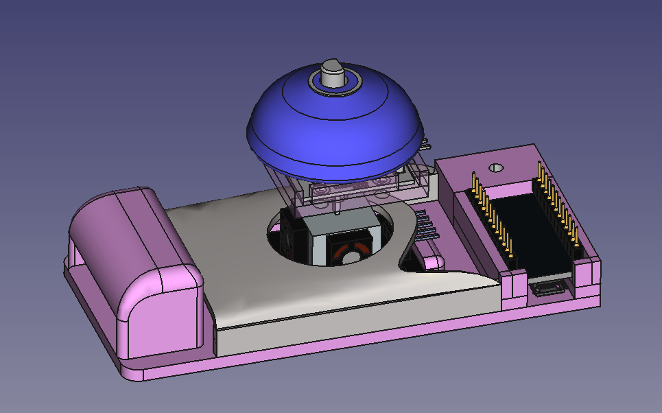
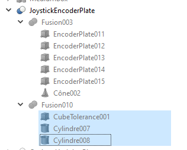
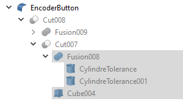
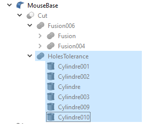
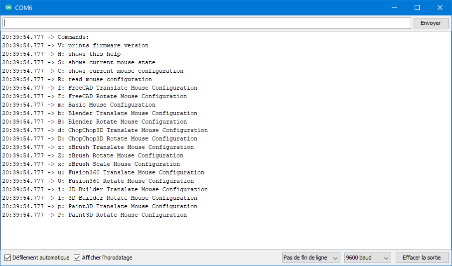
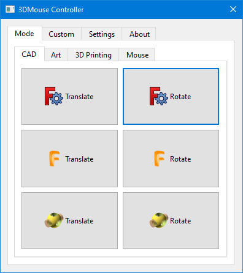
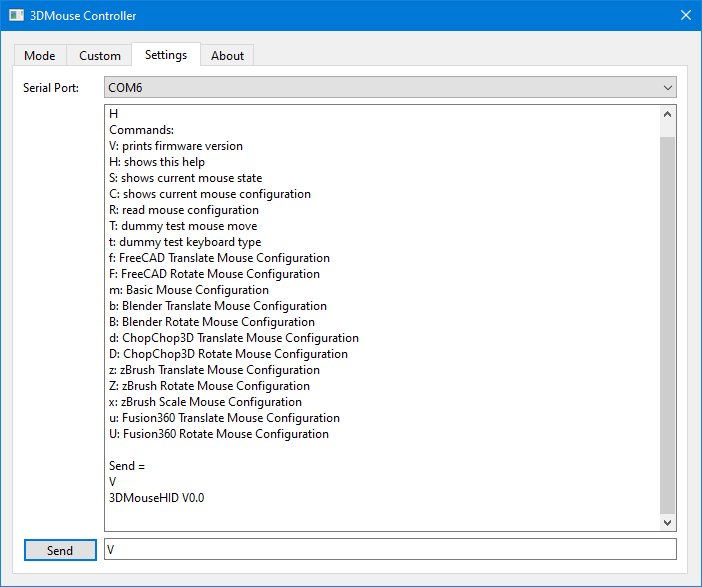

# 3DMouse
## Status
This is still in prototyping phase.... far away from a polished product by any means, nerd only.
 - Basic Rough Hardware [OK]
 - Firmware [OK]
 - Software for Control and Customization [Control OK, Customization PENDING]

## Overview
Inspired by the great work made by https://github.com/FaqT0tum/Orbion_Space_Mouse
- Using exactly the same hardware but without the LCD Display Part. 
- Cost less than 20$ 
- The idea is to have a small software on the PC where you can "**program**" the firmware of the 3D Mouse according to your software and your preferences, hence the removal of the LCD screen
- Easy to prototype 

## BOM
 - Arduino Pro Micro (**ATMEL32U4**) + Soldered prototyping pins + Associated USB Cable
 - Encoder (**KY-040**)
 - Joystick (**KY-023**)
 - 6 M3 Screw 6mm length
 - Few prototyping female-female cables 

## CAD/3D Printed Parts
- It is a test bed: a base to integrate the Joystick + Arduino, a custom button on top of the Encoder and a custom Encoder/Joystick base.

### 3D Printing Steps
- The tolerances for the holes are fully customizable inside the provided FreeCAD files, each printer/filament is different. Try to use the same filament roll when 3D printing those parts to prevent additional iterations due to tolerance changes.

1) Start by first printing the custom Encoder/Joystick base (less than 1 hour in 0.2mm) to setup your baseline for Tolerances for the M3 holes and the **critical tolerance** to the Joystick pin (not too tight, but no play). Orientation is upside down to finish the Joystick pin hole: you will have few supports to remove. Then update accordingly the FreeCAD/STL file for the tolerance.

2) For the Encoder button you will have to perform the same step for the tolerance (a bit more than 1 hour to print in 0.2mm).

3) Finally the base using the tolerance for M3 holes you put in the first step.

## Assembly
1) Put on the 3D Printed Base the Joystick and screw 4 M3 by 6mm on it
2) Put the Encoder on the 3D Printed Joystick/Encoder Plate and screw 2 M3 by 6MM on it
3) Put the 3D Printed Button on the Encoder 
4) Push the 3D Printed Joystick/Encoder Plate on the Joystick pin
5) Put the Arduino in the base as shown in the previous image
6) Put the wires (TODO: schematic)
7) Compile and Upload the firmware

## Firmware 
- Regular Arduino Env using standard libraries + Encoder library (provided in Arduino IDE): compile and upload
- *PoC*: basic features are there, may still change slightly from a commit to another one
- High-Level:
    -   Basic Loop: 
        -  Read Serial Port (if something present to change the configuration/the mode of the mouse)
        -  Read 3D Mouse Inputs (Buttons, Encoder, Joystick)
        -  Process and write to the PC through USB HID (Keyboard/Mouse)
    -   Features:
        - Debug Hardware (serial monitor) [OK]
        -  Basic Mouse Emulator (single button) [OK]
        -  FreeCAD (translate, rotation mode) [OK] [Experimental: Click on Joystick Button switch back and forth from Translate/Rotate mode]
        -  Blender (translate, rotation mode) [OK]
        -  ChopChop3D Slicer (translate, rotation mode) [OK]
        -  Fusion360 (translate, rotation mode) [OK]	
        -  ZBrush (translate, rotation, scale mode) [TO TEST]
        -  3D Builder (translate, rotation mode) [OK]
        -  Painter 3D (translate, rotation mode) [OK]
    -   How to:
        -  Connect the 3DMouse to the Computer
        -  Arduino IDE: Compile and Upload the Firmware
        -  Arduino IDE: Launch the Serial Monitor
	
        -  Connect with 9600 baud, No End of Line
        -  Type H and Send
        -  Then choose the mode you need: Type the character and Send

## Software
- *PoC*: basic features are there, may still change slightly from a commit to another one
    -   Connect to the Mouse [OK]
    -   Serial Port Monitor [OK]
    -   Update the Mode of the Mouse on the Fly with Buttons [OK]
    -   Customization for Mouse Configuration [PENDING]

	
    
# License
**MIT** see LICENSE file.
        